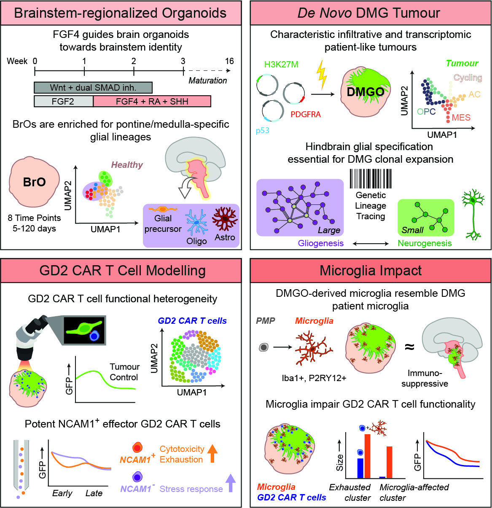

# Transcriptomic profiling of BrO, DMGO and GD2 CAR T cells

Repository accompanying the publication **De novo H3.3K27M-altered Diffuse Midline Glioma in human brainstem organoids to dissect GD2 CAR T cell function**

The repository is organized firstly per model and secondly per coding language

* `BrO/`: Code. jupyter notebooks and Rmd files used for analyzing the time course sequencing data of the Brainstem Organoid, including annotation, reference mapping against the [HNOCA](https://doi.org/10.1038/s41586-024-08172-8) and the [HDBCA](https://doi.org/10.1126/science.adf1226)
* `DMGO/`: 
* `CART/`:

For code related to the lineage tracing data please refer to this [GitHub](https://github.com/anna-alemany/TrackerSeq_BROs)

> Bessler, N.; Wezenaar A.K.L.; Ariese, H.C.R.; Honhoff, C. et al. De novo H3.3K27M-altered Diffuse Midline Glioma in human brainstem organoids to dissect GD2 CAR T cell function. Nature Cancer, 2025

